# 企业内部知识管理与协同软件搭建过程

>为了保证环境的独立性，和服务器其他的环境不冲突，所以全程所有的环境都在一个干净的docker容器中创建。


## 一、安装Docker

> 首先，在服务器（公司的服务器系统是CentOS7）中安装Docker。

### 1.系统更新

> 如果是最新的不需要进行更新，docker也不需要卸载，可以直接使用。

- 切换成root用户，输入密码

```shell
$ su root
```


- Docker要求CentOS系统内核高于3.10，查看当前内核版本

```shell
$ uname -r
```

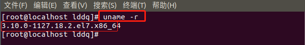


- 更新yum包到最新状态

```shell
$ yum update	
```


### 2.安装Docker步骤

- 卸载旧版本（如果安装过的话，没有可以跳过这步）

```shell
$ yum remove docker  docker-common docker-selinux docker-engine
```


- 安装需要的依赖

```shell
$ yum install -y yum-utils device-mapper-persistent-data lvm2
```


- 设置安装docker的yum源

```shell
$ yum-config-manager --add-repo https://download.docker.com/linux/centos/docker-ce.repo
```


- 查看yum仓库中所有的docker版本，选择安装

```shell
$ yum list docker-ce --showduplicates | sort -r
```


- 安装docker命令

```shell
$ sudo yum install docker-ce
# 指定版本安装
$ sudo yum install docker版本
```


- 启动docker并加入开机启动

```shell
$ systemctl start docker
$ systemctl enable docker
```


- 验证docker是否安装成功

```shell
$ docker version
```

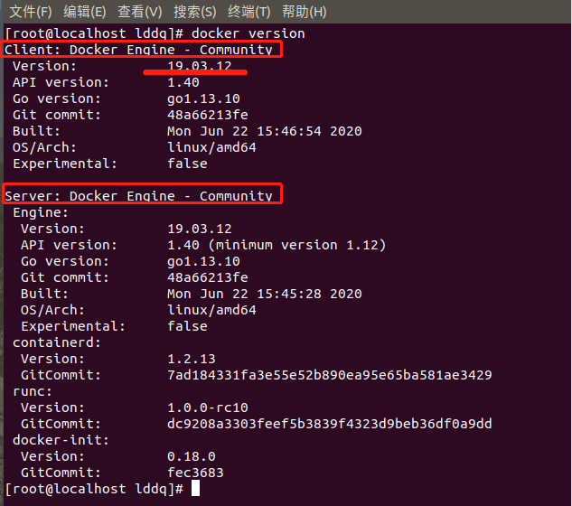


- docker拉取空白的centos镜像（空白的意思就是说只有一个系统，不附带任何的其他内容，如果dockerhub中能找到该环境都有的内容也可以选择）

```shell
$ docker pull centos:7
```

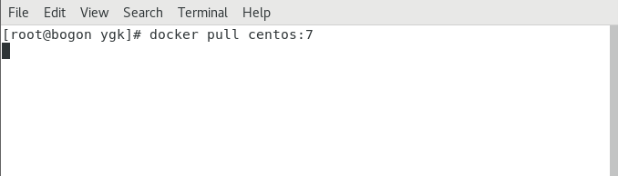


- 查看拉取到的镜像

```shell
$ docker images
```

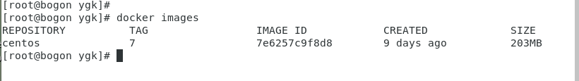


- 用刚刚下载的centos镜像，以特权模式创建并运行一个docker容器（之所以用特权模式是因为如果不用的话，在容器内将不可以使用systemctl命令来操作服务）

```shell
$ docker run -d --privileged=true -p 4490:8090 --name confluence centos:7 /usr/sbin/init
```

  参数说明：

​		-d：后台运行容器并返回容器ID

​		--privileged=true和/usr/sbin/init：让容器内部可以使用systemctl命令

​		-p：端口映射，这里是将容器内部的8090端口映射到宿主机的4490端口，之所以映射8090端口，是因为confluence默认端口为8090，为了后面方便

​		--name：给创建的容器取个名字


- 查看通过上述命令创建的docker容器内容

```shell
$ docker ps -a
```

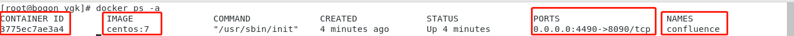


- 进入刚刚创建的confluence容器内部

```shell
$ docker exec -it confluence /bin/bash
```

命令和参数介绍：

​		docker exec：在运行的容器内执行命令

​		-i：交互式操作

​		-t：分配一个伪终端

​		/bin/bash：开启交互式shell

从下图中可以看出root@后面变成了容器的ID号，说明已经进入容器，接下来将在容器内进行相关的环境配置

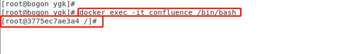


## 二、Docker容器中的操作

### 1.安装JDK8并配置环境变量

- JDK包提取

  链接：https://pan.baidu.com/s/1n6-6laz4WUS__5C04TK2VQ 
  提取码：hzpy

- 在docker容器的centos系统中的home目录下创建一个java目录


- 将Windows中的JDK压缩包上传至centos系统中
  - 使用xshell连接服务器系统，然后打开xftp传送文件到服务器的/home/ygk/Documents目录下
  - 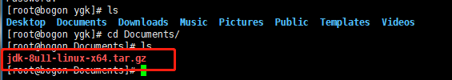
  - xshell和xftp软件安装包
    - 链接：https://pan.baidu.com/s/154ISz4gasZXZ6y7b7xMMWg 
      提取码：8k3s

- 找到JDK包并跳转到该目录下，将centos系统中的JDK包传入docker容器内的centos系统中的/home/java目录下

```shell
$ docker cp ./jdk-8ull-linux-x64.tar.gz 3775ec7ae3a4:/home/java
```

- 在docker容器的交互式环境中查看文件是否传入

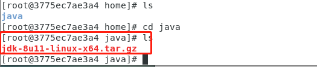


- 解压JDK压缩包

```
$ tar -zxvf jdk-8ull-linux-x64.tar.gz
```

解压完成后：


- 配置java环境变量

  - 打开文件

    ```shell
    $ vim /etc/profile
    ```

    没有vim命令可以使用` yum install vim`安装

  - 在文件末尾添加以下内容，然后保存退出

    ```shell
    export JAVA_HOME=/home/java/jdk1.8.0_11
    export JRE_HOME=${JAVA_HOME}/jre
    export CLASSPATH=.:${JAVA_HOME}/lib:${JRE_HOME}/lib
    export PATH=${JAVA_HOME}/bin:$PATH
    ```

  - 加载环境变量，使之生效

    ```shell
    $ source /etc/profile
    ```

  - 检测环境变量是否生效

  - ```shell
    $ java -version
    ```

    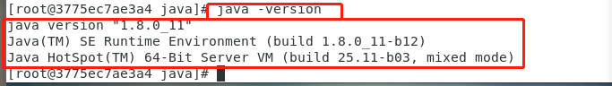

    

    出现这样的结果说明jdk已经安装完成，并成功配置了环境变量


### 2.安装MySQL5.7

- 安装MySQL源

  ```shell
  # 下载
  $ wget https://dev.mysql.com/get/mysql57-community-release-el7-11.noarch.rpm
  # 安装 mysql 源
  $ yum localinstall mysql57-community-release-el7-11.noarch.rpm
  ```

  没有wget命令需要先进行安装`yum install wget`

  

- 检测MySQL源是否安装成功

  ```shell
  $ yum repolist enabled | grep "mysql.*-community.*"
  ```

  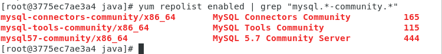

  如此，表示安装成功

- yum install安装MySQL

  ```shell
  $ yum install -y mysql-community-server
  ```

- 启动MySQL服务

  ```shell
  $ systemctl start mysqldd
  ```

- 打开一个新的Terminal窗口再次进入到容器内部，查看MySQL的状态

  ```shell
  $ systemctl status mysqld
  ```

  启动状态是activating或者是running

- 设置开机启动服务

  ```shell
  $ systemctl enable mysqld
  # 重载所有修改过的配置文件
  systemctl daemon-reloadx
  ```

- 修改root本地账户密码

  - MySQL安装完成会生成默认密码，在/var/log/mysqld.log文件中。可以使用grep命令找到日志中的初始密码

    ```shell
    $ grep 'temporary password' /var/log/mysqld.log
    ```

  - 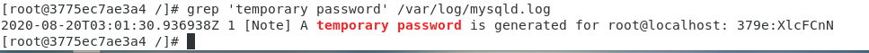

  - 得到初始密码后，登陆MySQL进行密码修改

    ```mysql
    $ mysql -u root -p
    
    mysql> ALTER USER 'root'@'localhost' IDENTIFIED BY 'Lddq0820!'; 
    # 或者用
    mysql> set password for 'root'@'localhost'=password('MyNewPass4!');
    ```

  - 添加远程登陆用户

  - ```mysql
    mysql> GRANT ALL PRIVILEGES ON *.* TO 'root'@'%' IDENTIFIED BY 'Lddq0820!' WITH GRANT OPTION;
    ```

  

  - 设置默认编码为utf8

    - 修改/etc/my.cnf配置文件，相关节点下添加如下内容，没有的自己添加

      ```shell
      [mysqld]
      character-set-server=utf8
      collation-server=utf8_bin
      default-storage-engine=INNODB
      max_allowed_packet=256M
      innodb_log_file_size=2GB
      transaction-isolation=READ-COMMITTED
      [client]
      default-character-set=utf8
      [mysql]
      default-character-set=utf8
      ```

    - 重启MySQL服务，查询编码是否改变

      ```mysql
      $ systemctl restart mysqld
      $ mysql -uroot -p
      
      mysql> show variables like 'character%'
      ```

      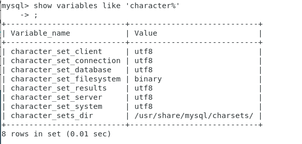

- 在数据库中创建一个confluence的数据库

```mysql
mysql> CREATE DATABASE confluence CHARACTER SET utf8 COLLATE utf8_bin;
```


### 3.安装confluence

confluence安装程序和破解程序地址

> 链接：https://pan.baidu.com/s/13mZBodg5otBHlrp2cAfDeg 
> 提取码：n9rp


- 将上面链接的所有包下载到Windows中
- 将confluence安装程序上传到服务器中

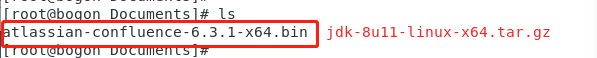

- 将服务器中的confluence安装程序传入docker容器系统中的home目录下

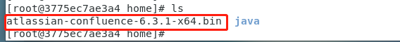


- 开始安装confluence，进入容器系统的home目录下，执行命令

```shell
$ ./atlassian-confluence-6.3.1-x64.bin
```

直接执行会发现该文件没有执行权限，所以需要添加执行权限

```shell
$ chmod +x atlassian-confluence-6.3.1-x64.bin
```

然后再次执行上面的安装命令，在安装过程中第一次需要按回车，第二次需要按1然后回车，之后的一直回车即可，根据提示来就行。

安装成功之后可以打开浏览器进行访问：http://192.168.4.153:4490

看到如下界面，即表示安装完成

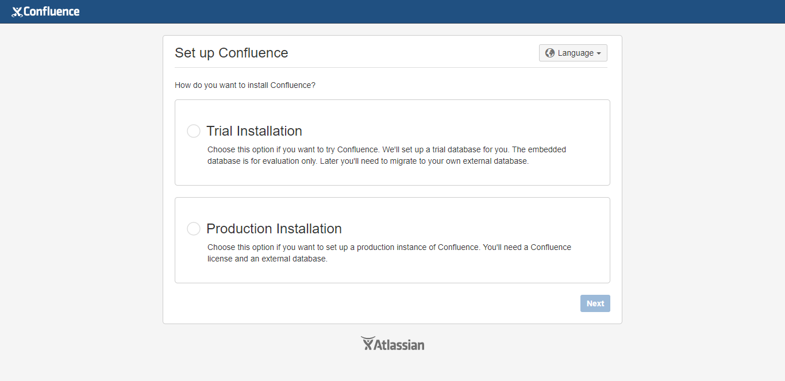


## 三、confluence相关配置

### 1.初始配置

- 选择语言为中文

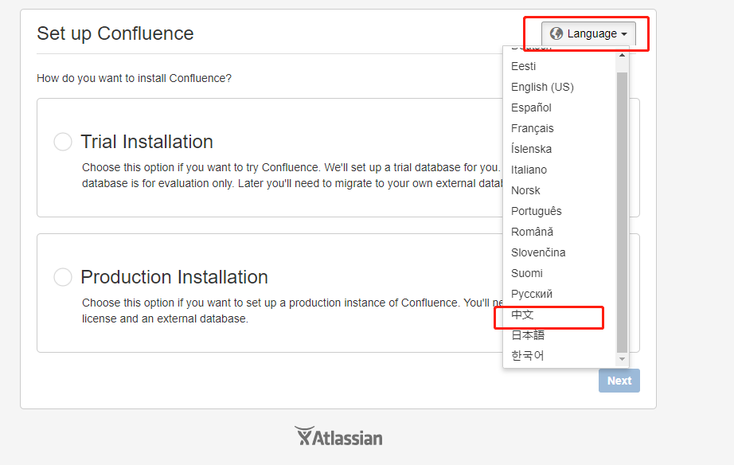


- 选择产品安装，然后下一步

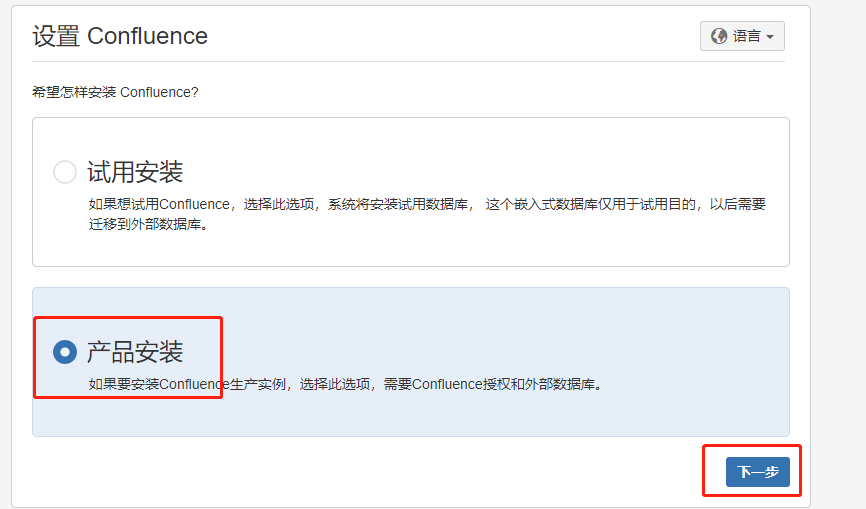


- 直接再次选择下一步

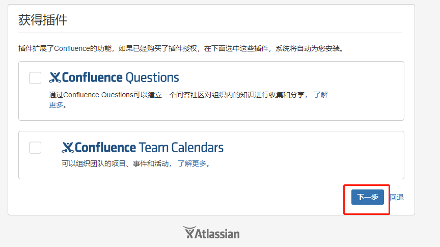


- 出现如下页面时，不再进行操作，暂停在该页面，记下服务器ID，稍后破解时需要使用

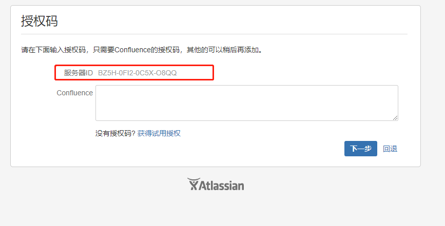


### 2.破解配置

> 破解需要使用到之前下载的那个压缩包中的注册机，所以在Windows中将该文件解压

- 首先停止confluence服务

```shell
$ sh /opt/atlassian/confluence/bin/stop-confluence.sh
```

- 从刚刚安装的目录中导出jar进行破解，并且改名atlassian-extras-2.4.jar：

```shell
$ cd /opt/atlassian/confluence/confluence/WEB-INF/lib/
$ mv atlassian-extras-decoder-v2-3.2.jar atlassian-extras-2.4.jar
```

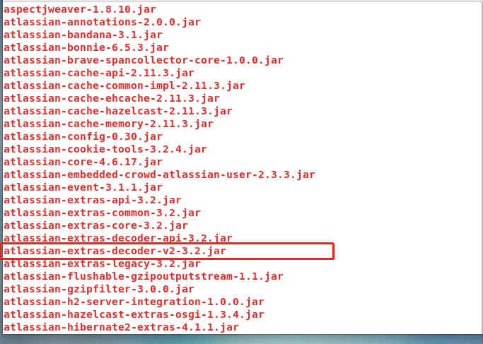


- 将改名后得到的atlassian-extras-2.4.jar文件一步步传到Windows系统中

  - 从docker容器中传到服务器当前目录下也是一开始的Document文件夹（存放jkd压缩包的目录）

  - ```shell
    $ docker cp confluence:/opt/atlassian/confluence/confluence/WEB-INF/lib/atlassian-extras-2.4.jar ./
    ```

  - 在使用xftp将该文件下载到Windows系统中

- 找到之前解压的confluence破解工具，进入目录里双击运行confluence_keygen.jar文件（确保Windows系统中安装有jdk，如果没有先安装），出现如下界面：

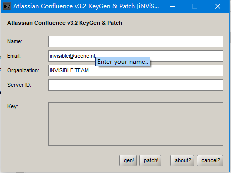


- name随意填写，email、organization不用变，server ID输入之前访问confluence停留页面的服务器ID，

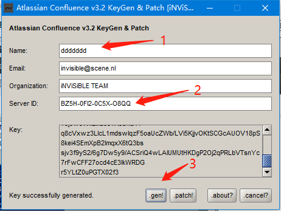

- 信息输入完成后，点击 .gen!生成验证码，如上图，
- 然后点击 .patch! 上传之前从服务器导出的jar包，之后就会得到破解之后的jar包，之前的jar包会生成一个.bak的备份文件
- 现在把破解了的jar包按原路返回到导出来的目录并改回原来的名字（Windows下的jar--->服务器下的jar--->docker中安装目录下的jar）
- 重新启动confluence

```shell
$ sh /opt/atlassian/confluence/bin/start-confluence.sh
```

- 然后回到浏览器之前暂停的地方刷新，然后输入之前破解时生成的授权码，点击下一步

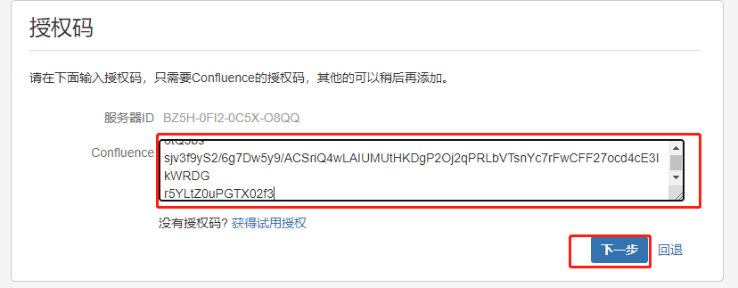

- 选择MySQL之后，点击外部数据库，发现报错，原因是没有安装数据库连接驱动

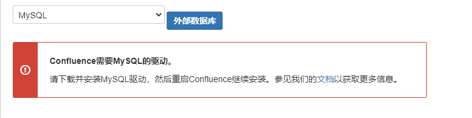


- 下载数据库连接驱动

  - 链接：https://pan.baidu.com/s/1ulsl9fsry_F_rX5OZbBsxw 
    提取码：kqde 

  - 重启服务后刷新页面

    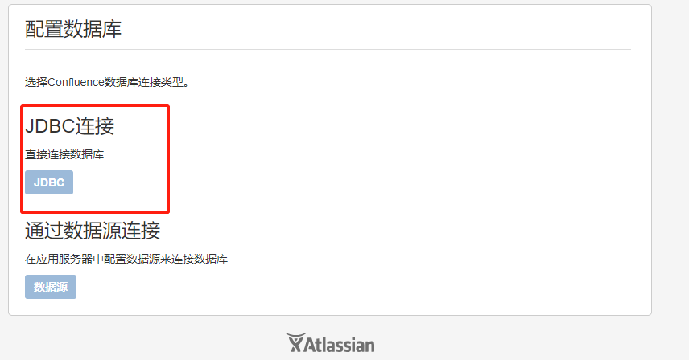

    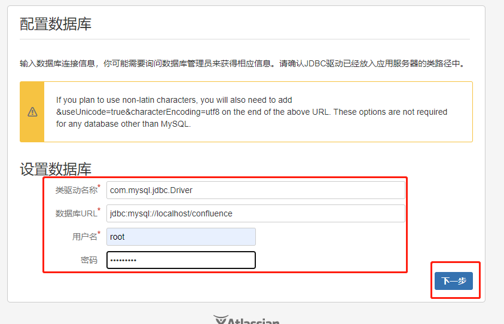

    

- 之后进入就是设置管理员用户即可，到此为止已经完全部署成功


注：若在虚拟机上部署，请注意电脑的性能。